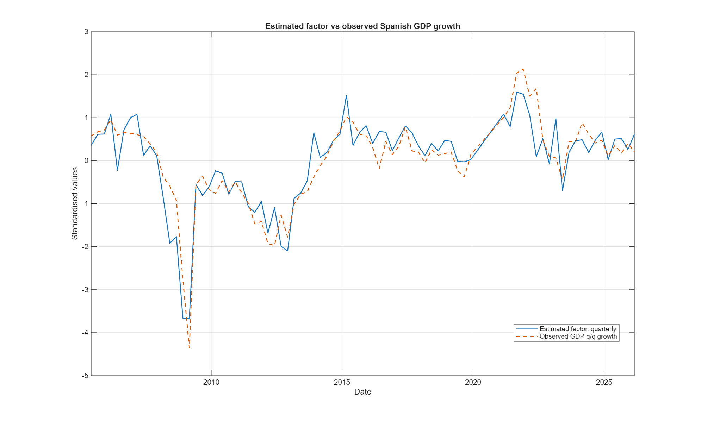

# Spain GDP Nowcast with a Mixed-Frequency Dynamic Factor Model

This repository contains my Advanced Time Series project on nowcasting Spanish real GDP growth from monthly indicators. I kept MATLAB as the modelling language used in the course; Python is only used to download and prepare the data.

The monthly information set contains industrial production, Social Security affiliation, retail sales, imports, tourism overnight stays and the Economic Sentiment Indicator (ESI).



*Figure from the submitted course version. Running the MATLAB code regenerates the figures in `outputs/`.*

## Model

The model has 29 states:

- 12 for the common monthly factor and its lags;
- 5 for the GDP idiosyncratic component;
- 2 AR(2) states for each of the six monthly indicators.

Quarterly GDP is linked to the monthly factor using the weights
`[1/3, 2/3, 1, 2/3, 1/3]`.

IPI and retail sales load on the contemporaneous factor. Affiliation, imports and tourism are expressed as 12-month growth rates and load on the current factor plus 11 monthly lags. **ESI stays in levels and also loads on the current factor plus 11 lags, as a soft indicator.** This is the fixed specification used throughout the project.

The common factor and the idiosyncratic components follow AR(2) dynamics. Parameters are estimated by maximum likelihood with `fminunc`, and the latent states are estimated with a Kalman filter.

## Data

| Variable | Frequency | Transformation | Source |
|---|---|---|---|
| Real GDP | quarterly | q/q log growth | Eurostat |
| Industrial production | monthly | m/m log growth | Eurostat |
| Social Security affiliation | monthly | y/y log growth | Spanish Social Security |
| Retail sales | monthly | m/m log growth | Eurostat |
| Imports | monthly | y/y log growth | OECD via FRED |
| Tourism overnight stays | monthly | y/y log growth | Eurostat |
| ESI | monthly | level | European Commission / Eurostat |

The exact series codes, filters and URLs are in [`data/source_manifest.csv`](data/source_manifest.csv). Imports use OECD/FRED series `XTIMVA01ESM667S`.

The preprocessing follows the final assignment specification: observations from 2020 are masked for all variables, and the three year-on-year monthly series are also masked during 2021 because their base period is in 2020.

## Run the project

The repository already includes the data snapshot used in the project. To refresh it:

```bash
python -m venv .venv
# Windows: .venv\Scripts\activate
# macOS/Linux: source .venv/bin/activate
pip install -r requirements.txt
python python/01_download_spain_raw_data.py
python python/02_prepare_model_data.py
```

To estimate the DFM and produce the next two quarterly nowcasts, run from the repository root in MATLAB:

```matlab
run('matlab/run_nowcast.m')
```

`current_forecasts.csv` reports the point forecasts, their conditional standard errors and 65%/95% Gaussian intervals. The intervals come from propagating the filtered state covariance through the fitted state-space model; parameter-estimation uncertainty is not included.

MATLAB's Optimization Toolbox is required for `fminunc`.

## Pseudo-out-of-sample evaluation

```matlab
run('matlab/run_pseudo_oos.m')
```

For each target quarter from 2015 onward, the script keeps monthly information only through the second month of the target quarter, re-estimates the model and standardisation using the expanding historical sample, and compares the DFM nowcast with persistence, a quarterly AR(1) and the historical mean.

This is a **pseudo-OOS** exercise rather than a true real-time backtest because the historical series are current-vintage data; archived release vintages and publication calendars were not part of the course dataset.

### Results

The scripts retain all DFM forecasts, including 2021Q1, but benchmark metrics use the 40 quarters for which the DFM, persistence and AR(1) are all available. On that common sample:

| Model | RMSE (pp) | MAE (pp) | Correlation |
|---|---:|---:|---:|
| DFM | **0.280** | **0.220** | **0.772** |
| Persistence | 0.296 | 0.231 | 0.752 |
| AR(1) | 0.301 | 0.233 | 0.737 |
| Historical mean | 0.655 | 0.509 | -0.010 |

The DFM improves modestly on persistence and the AR(1) in this sample. With only 40 common forecast quarters, I treat the difference as suggestive rather than conclusive. The 2020 gap in the plot is intentional: those observations are masked by the assignment specification.

## Factor correlation

The factor/GDP correlation in the original report is an in-sample diagnostic: GDP is itself one of the observations used by the state-space model. I therefore keep the figure as a useful description of the estimated factor, but use the pseudo-OOS exercise for forecast evaluation.

## Changes from the submitted code

For the GitHub version I kept the original economic specification and made a small number of code changes:

- missing observations are skipped in the Kalman measurement update instead of being filled with simulated values;
- repeated state positions and global variables were replaced with clearer MATLAB functions;
- the fitted AR(2) blocks are checked for stationarity;
- the pseudo-OOS script re-estimates both the standardisation and the model in every fold;
- the data sources are recorded explicitly, including the imports series that was missing from the original documentation.

These changes can lead to slightly different estimates from the submitted report because the treatment of missing observations is no longer random.

The original course report is available in [`report/ATS_Project_JeronimoAragon.pdf`](report/ATS_Project_JeronimoAragon.pdf).

## Repository structure

```text
.
├── matlab/       # DFM, Kalman filter, nowcast and pseudo-OOS evaluation
├── python/       # data download and preparation
├── data/         # project snapshot and exact source list
└── report/       # submitted report and figures
```

## Limitations

- The pseudo-OOS exercise does not reconstruct historical data vintages or release dates.
- The 2020/2021 masking rule is inherited from the assignment rather than modelling the COVID shock directly.
- The factor/GDP correlation is not a measure of out-of-sample accuracy.
- The model is linear and Gaussian and uses one common factor.
